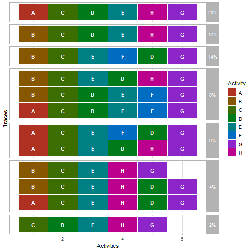
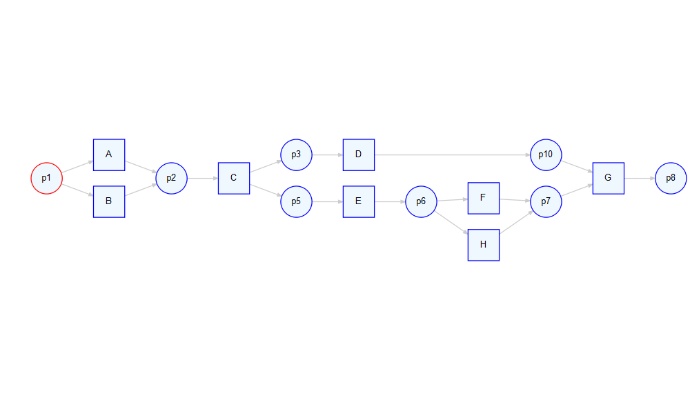
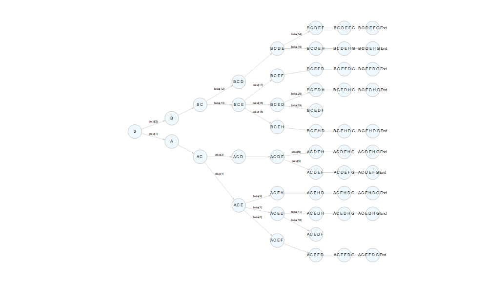

```r
library(propro)
library(bupaR)
library(petrinetR)
```


This document introduces propro, an R-package for constructing probabilistic process models using Bayesian inference and MCMC. In this illustration, we will use the following event log.


```r
log <- log_2_paper_ICPM
log %>%
    trace_explorer(coverage = 1)
```



Furthermore, we will use the following model.


```r
net <- model_2_paper_ICPM
net$final_marking <- "p8"
render_PN(net)
```



Constructing a process model strats with the create_propro function

```r
create_propro(log, net) -> propro
#> Joining, by = "trace"
#> Joining, by = c("from_state", "to_state")
#> Joining, by = c("from_state", "to_state")
#> Joining, by = c("from_state", "to_state")
#> Joining, by = "trace"
```
Which we can view by printing it


```r
print_propro(propro)
#> model{
#> 
#> y[1:12] ~ dmulti(theta[1:12], N)
#> 
#> theta[1] <- beta_f*beta[2]*beta[13]*beta[18]
#> theta[2] <- beta_f*beta[2]*beta[13]*beta[17]
#> theta[3] <- beta_f*beta[2]*beta[13]*beta[16]*beta[20]
#> theta[4] <- beta_f*beta[2]*beta[12]*beta[15]
#> theta[5] <- beta_f*beta[2]*beta[12]*beta[14]
#> theta[6] <- beta_f*beta[1]*beta[4]*beta[9]
#> theta[7] <- beta_f*beta[1]*beta[4]*beta[8]
#> theta[8] <- beta_f*beta[1]*beta[4]*beta[7]*beta[11]
#> theta[9] <- beta_f*beta[1]*beta[3]*beta[6]
#> theta[10] <- beta_f*beta[1]*beta[3]*beta[5]
#> theta[11] <- (1-beta_f)
#> theta[12] <- beta_f*beta[2]*beta[13]*beta[16]*beta[19] + beta[1]*beta[4]*beta[7]*beta[10]
#> 
#> beta[1]
#> beta[2]
#> beta[3]
#> beta[4]
#> beta[5]
#> beta[6]
#> beta[7]
#> beta[8]
#> beta[9]
#> beta[10]
#> beta[11]
#> beta[12]
#> beta[13]
#> beta[14]
#> beta[15]
#> beta[16]
#> beta[17]
#> beta[18]
#> beta[19]
#> beta[20]
#> beta_f
#> 
#> }
```

In order to see what the different beta's refer to, we can plot the underlying automaton


```r
plot_automaton(propro)
```



We now have to specify the priors. Let's start by automatically setting to complements of all splits which have two options.

```r
propro %>%
    set_prior_complements(n = 2) %>%
    list_priors()
#> Joining, by = "choice_id"
#> # A tibble: 21 x 3
#>    prior    choice_id specification   
#>    <chr>        <int> <chr>           
#>  1 beta[1]          1 <NA>            
#>  2 beta[2]          1 <- 1 - (beta[1])
#>  3 beta[3]          2 <NA>            
#>  4 beta[4]          2 <- 1 - (beta[3])
#>  5 beta[5]          3 <NA>            
#>  6 beta[6]          3 <- 1 - (beta[5])
#>  7 beta[7]          4 <NA>            
#>  8 beta[8]          4 <NA>            
#>  9 beta[9]          4 <NA>            
#> 10 beta[10]         5 <NA>            
#> # ... with 11 more rows
```


Furthermore, we can see that the some probabilities should be the same if we interpret the petri net strictly. We therefor implement the following constraints.

beta 3 = beta 12
beta 5 = beta 10 = beta 14 = beta 19
beta 8 = beta 17
beta 7 = beta 16
beta 9 = beta 18


```r
propro %>%
    set_prior_complements(n = 2) %>%
    set_prior("beta[12]", "<- beta[3]")%>%
    set_prior("beta[10]", "<- beta[5]")%>%
    set_prior("beta[14]", "<- beta[5]")%>%
    set_prior("beta[19]", "<- beta[5]")%>%
    set_prior("beta[17]", "<- beta[8]")%>%
    set_prior("beta[16]", "<- beta[7]")%>%
    set_prior("beta[18]", "<- beta[9]") %>%
    list_priors
#> Joining, by = "choice_id"
#> # A tibble: 21 x 3
#>    prior    choice_id specification   
#>    <chr>        <int> <chr>           
#>  1 beta[1]          1 <NA>            
#>  2 beta[2]          1 <- 1 - (beta[1])
#>  3 beta[3]          2 <NA>            
#>  4 beta[4]          2 <- 1 - (beta[3])
#>  5 beta[5]          3 <NA>            
#>  6 beta[6]          3 <- 1 - (beta[5])
#>  7 beta[7]          4 <NA>            
#>  8 beta[8]          4 <NA>            
#>  9 beta[9]          4 <NA>            
#> 10 beta[10]         5 <- beta[5]      
#> # ... with 11 more rows
```

Now we can define the remain priors. For beta 7,8 and 9, we will use a Dirichlet distributions. Therefore, we first combine these into one prior specification. Then we define the distribution and add alpha to the data.


```r
propro %>%
    set_prior_complements(n = 2) %>%
    set_prior("beta[12]", "<- beta[3]")%>%
    set_prior("beta[10]", "<- beta[5]")%>%
    set_prior("beta[14]", "<- beta[5]")%>%
    set_prior("beta[19]", "<- beta[5]")%>%
    set_prior("beta[17]", "<- beta[8]")%>%
    set_prior("beta[16]", "<- beta[7]")%>%
    set_prior("beta[18]", "<- beta[9]") %>%
    combine_consecutive_priors(start = 7, end = 9) %>%
    set_prior("beta[7:9]", "<- ddirich(alpha[1:3])") %>%
    add_data("alpha", c(1,1,1)) %>%
    list_priors
#> Joining, by = "choice_id"
#> # A tibble: 19 x 4
#>    prior     choice_id specification             nr
#>    <chr>         <int> <chr>                  <dbl>
#>  1 beta[1]           1 <NA>                       1
#>  2 beta[2]           1 <- 1 - (beta[1])           2
#>  3 beta[3]           2 <NA>                       3
#>  4 beta[4]           2 <- 1 - (beta[3])           4
#>  5 beta[5]           3 <NA>                       5
#>  6 beta[6]           3 <- 1 - (beta[5])           6
#>  7 beta[10]          5 <- beta[5]                10
#>  8 beta[11]          5 <- 1 - (beta[10])         11
#>  9 beta[12]          6 <- beta[3]                12
#> 10 beta[13]          6 <- 1 - (beta[12])         13
#> 11 beta[14]          7 <- beta[5]                14
#> 12 beta[15]          7 <- 1 - (beta[14])         15
#> 13 beta[16]          8 <- beta[7]                16
#> 14 beta[17]          8 <- beta[8]                17
#> 15 beta[18]          8 <- beta[9]                18
#> 16 beta[19]          9 <- beta[5]                19
#> 17 beta[20]          9 <- 1 - (beta[19])         20
#> 18 beta_f           NA <NA>                      NA
#> 19 beta[7:9]        NA <- ddirich(alpha[1:3])    NA
```
All remaining priors we will set to beta distribution with paramters a = 1 and b = 1.


```r
propro %>%
    set_prior_complements(n = 2) %>%
    set_prior("beta[12]", "<- beta[3]")%>%
    set_prior("beta[10]", "<- beta[5]")%>%
    set_prior("beta[14]", "<- beta[5]")%>%
    set_prior("beta[19]", "<- beta[5]")%>%
    set_prior("beta[17]", "<- beta[8]")%>%
    set_prior("beta[16]", "<- beta[7]")%>%
    set_prior("beta[18]", "<- beta[9]") %>%
    combine_consecutive_priors(start = 7, end = 9) %>%
    set_prior("beta[7:9]", "~ddirich(alpha[1:3])") %>%
    add_data("alpha", c(1,1,1)) %>%
    set_prior("beta[1]", "~dbeta(1,1)")%>%
    set_prior("beta[3]", "~dbeta(1,1)")%>%
    set_prior("beta[5]", "~dbeta(1,1)")%>%
    set_prior("beta_f", "~dbeta(1,1)") %>%
    list_priors()
#> Joining, by = "choice_id"
#> # A tibble: 19 x 4
#>    prior     choice_id specification           nr
#>    <chr>         <int> <chr>                <dbl>
#>  1 beta[1]           1 ~dbeta(1,1)              1
#>  2 beta[2]           1 <- 1 - (beta[1])         2
#>  3 beta[3]           2 ~dbeta(1,1)              3
#>  4 beta[4]           2 <- 1 - (beta[3])         4
#>  5 beta[5]           3 ~dbeta(1,1)              5
#>  6 beta[6]           3 <- 1 - (beta[5])         6
#>  7 beta[10]          5 <- beta[5]              10
#>  8 beta[11]          5 <- 1 - (beta[10])       11
#>  9 beta[12]          6 <- beta[3]              12
#> 10 beta[13]          6 <- 1 - (beta[12])       13
#> 11 beta[14]          7 <- beta[5]              14
#> 12 beta[15]          7 <- 1 - (beta[14])       15
#> 13 beta[16]          8 <- beta[7]              16
#> 14 beta[17]          8 <- beta[8]              17
#> 15 beta[18]          8 <- beta[9]              18
#> 16 beta[19]          9 <- beta[5]              19
#> 17 beta[20]          9 <- 1 - (beta[19])       20
#> 18 beta_f           NA ~dbeta(1,1)             NA
#> 19 beta[7:9]        NA ~ddirich(alpha[1:3])    NA
```

Finally, let's add additional variable. For example, a delta which compares beta[5] with beta[8]. Then we save the propro model.


```r
propro %>%
    set_prior_complements(n = 2) %>%
    set_prior("beta[12]", "<- beta[3]")%>%
    set_prior("beta[10]", "<- beta[5]")%>%
    set_prior("beta[14]", "<- beta[5]")%>%
    set_prior("beta[19]", "<- beta[5]")%>%
    set_prior("beta[17]", "<- beta[8]")%>%
    set_prior("beta[16]", "<- beta[7]")%>%
    set_prior("beta[18]", "<- beta[9]") %>%
    combine_consecutive_priors(start = 7, end = 9) %>%
    set_prior("beta[7:9]", "~ddirich(alpha[1:3])") %>%
    add_data("alpha", c(1,1,1)) %>%
    set_prior("beta[1]", "~dbeta(1,1)")%>%
    set_prior("beta[3]", "~dbeta(1,1)")%>%
    set_prior("beta[5]", "~dbeta(1,1)")%>%
    set_prior("beta_f", "~dbeta(1,1)") %>%
    add_variable("delta[1]", "<- beta[5] - beta[9]") -> propro 
#> Joining, by = "choice_id"
```

The final models looks as follows.

```r
propro %>%
    print_propro()
#> model{
#> 
#> y[1:12] ~ dmulti(theta[1:12], N)
#> 
#> theta[1] <- beta_f*beta[2]*beta[13]*beta[18]
#> theta[2] <- beta_f*beta[2]*beta[13]*beta[17]
#> theta[3] <- beta_f*beta[2]*beta[13]*beta[16]*beta[20]
#> theta[4] <- beta_f*beta[2]*beta[12]*beta[15]
#> theta[5] <- beta_f*beta[2]*beta[12]*beta[14]
#> theta[6] <- beta_f*beta[1]*beta[4]*beta[9]
#> theta[7] <- beta_f*beta[1]*beta[4]*beta[8]
#> theta[8] <- beta_f*beta[1]*beta[4]*beta[7]*beta[11]
#> theta[9] <- beta_f*beta[1]*beta[3]*beta[6]
#> theta[10] <- beta_f*beta[1]*beta[3]*beta[5]
#> theta[11] <- (1-beta_f)
#> theta[12] <- beta_f*beta[2]*beta[13]*beta[16]*beta[19] + beta[1]*beta[4]*beta[7]*beta[10]
#> 
#> beta[1] ~dbeta(1,1)
#> beta[2] <- 1 - (beta[1])
#> beta[3] ~dbeta(1,1)
#> beta[4] <- 1 - (beta[3])
#> beta[5] ~dbeta(1,1)
#> beta[6] <- 1 - (beta[5])
#> beta[10] <- beta[5]
#> beta[11] <- 1 - (beta[10])
#> beta[12] <- beta[3]
#> beta[13] <- 1 - (beta[12])
#> beta[14] <- beta[5]
#> beta[15] <- 1 - (beta[14])
#> beta[16] <- beta[7]
#> beta[17] <- beta[8]
#> beta[18] <- beta[9]
#> beta[19] <- beta[5]
#> beta[20] <- 1 - (beta[19])
#> beta_f ~dbeta(1,1)
#> beta[7:9] ~ddirich(alpha[1:3])
#> 
#> delta[1] <- beta[5] - beta[9]
#> 
#> 
#> }
```

We can now run the model, after writing it to a file.


```r
propro %>%
    write_propro("propro_model2.txt") %>%
    run_propro(n.chains = 2, n.iter = 40000, n.burnin = 1000)
#> Compiling model graph
#>    Resolving undeclared variables
#>    Allocating nodes
#> Graph information:
#>    Observed stochastic nodes: 1
#>    Unobserved stochastic nodes: 5
#>    Total graph size: 34
#> 
#> Initializing model
#> 
#> 
  |                                                        
  |                                                  |   0%
  |                                                        
  |++++++++++++++++++++++++++++++++++++++++          |  80%
  |                                                        
  |++++++++++++++++++++++++++++++++++++++++++++++++++| 100%
#> 
  |                                                        
  |                                                  |   0%
  |                                                        
  |*                                                 |   2%
  |                                                        
  |**                                                |   4%
  |                                                        
  |***                                               |   6%
  |                                                        
  |****                                              |   8%
  |                                                        
  |*****                                             |  10%
  |                                                        
  |******                                            |  12%
  |                                                        
  |*******                                           |  14%
  |                                                        
  |********                                          |  16%
  |                                                        
  |*********                                         |  18%
  |                                                        
  |**********                                        |  21%
  |                                                        
  |***********                                       |  23%
  |                                                        
  |************                                      |  25%
  |                                                        
  |*************                                     |  27%
  |                                                        
  |**************                                    |  29%
  |                                                        
  |***************                                   |  31%
  |                                                        
  |****************                                  |  33%
  |                                                        
  |*****************                                 |  35%
  |                                                        
  |******************                                |  37%
  |                                                        
  |*******************                               |  39%
  |                                                        
  |*********************                             |  41%
  |                                                        
  |**********************                            |  43%
  |                                                        
  |***********************                           |  45%
  |                                                        
  |************************                          |  47%
  |                                                        
  |*************************                         |  49%
  |                                                        
  |**************************                        |  51%
  |                                                        
  |***************************                       |  53%
  |                                                        
  |****************************                      |  55%
  |                                                        
  |*****************************                     |  57%
  |                                                        
  |******************************                    |  59%
  |                                                        
  |*******************************                   |  62%
  |                                                        
  |********************************                  |  64%
  |                                                        
  |*********************************                 |  66%
  |                                                        
  |**********************************                |  68%
  |                                                        
  |***********************************               |  70%
  |                                                        
  |************************************              |  72%
  |                                                        
  |*************************************             |  74%
  |                                                        
  |**************************************            |  76%
  |                                                        
  |***************************************           |  78%
  |                                                        
  |****************************************          |  80%
  |                                                        
  |*****************************************         |  82%
  |                                                        
  |******************************************        |  84%
  |                                                        
  |*******************************************       |  86%
  |                                                        
  |********************************************      |  88%
  |                                                        
  |*********************************************     |  90%
  |                                                        
  |**********************************************    |  92%
  |                                                        
  |***********************************************   |  94%
  |                                                        
  |************************************************  |  96%
  |                                                        
  |************************************************* |  98%
  |                                                        
  |**************************************************| 100%
#> Inference for Bugs model at "propro_model2.txt", fit using jags,
#>  2 chains, each with 40000 iterations (first 1000 discarded), n.thin = 39
#>  n.sims = 2000 iterations saved
#>           mu.vect sd.vect   2.5%    25%    50%    75%  97.5%  Rhat n.eff
#> beta[10]    0.258   0.072  0.128  0.207  0.254  0.304  0.410 1.001  2000
#> beta[11]    0.742   0.072  0.590  0.696  0.746  0.793  0.872 1.001  1700
#> beta[12]    0.552   0.071  0.414  0.506  0.552  0.601  0.684 1.001  2000
#> beta[13]    0.448   0.071  0.316  0.399  0.448  0.494  0.586 1.001  2000
#> beta[14]    0.258   0.072  0.128  0.207  0.254  0.304  0.410 1.001  2000
#> beta[15]    0.742   0.072  0.590  0.696  0.746  0.793  0.872 1.001  1700
#> beta[16]    0.332   0.095  0.161  0.265  0.326  0.398  0.531 1.001  2000
#> beta[17]    0.458   0.101  0.268  0.386  0.458  0.528  0.652 1.001  2000
#> beta[18]    0.210   0.081  0.077  0.150  0.203  0.258  0.392 1.002  1500
#> beta[19]    0.258   0.072  0.128  0.207  0.254  0.304  0.410 1.001  2000
#> beta[1]     0.469   0.071  0.337  0.418  0.469  0.518  0.611 1.002  1200
#> beta[20]    0.742   0.072  0.590  0.696  0.746  0.793  0.872 1.001  1700
#> beta[2]     0.531   0.071  0.389  0.482  0.531  0.582  0.663 1.002  2000
#> beta[3]     0.552   0.071  0.414  0.506  0.552  0.601  0.684 1.001  2000
#> beta[4]     0.448   0.071  0.316  0.399  0.448  0.494  0.586 1.001  2000
#> beta[5]     0.258   0.072  0.128  0.207  0.254  0.304  0.410 1.001  2000
#> beta[6]     0.742   0.072  0.590  0.696  0.746  0.793  0.872 1.001  1700
#> beta[7]     0.332   0.095  0.161  0.265  0.326  0.398  0.531 1.001  2000
#> beta[8]     0.458   0.101  0.268  0.386  0.458  0.528  0.652 1.001  2000
#> beta[9]     0.210   0.081  0.077  0.150  0.203  0.258  0.392 1.002  1500
#> beta_f      0.923   0.036  0.833  0.902  0.928  0.950  0.977 1.001  2000
#> delta[1]    0.048   0.109 -0.162 -0.024  0.050  0.121  0.258 1.002  1000
#> theta[10]   0.062   0.022  0.027  0.046  0.059  0.075  0.112 1.001  2000
#> theta[11]   0.077   0.036  0.023  0.050  0.072  0.098  0.167 1.001  2000
#> theta[12]   0.037   0.016  0.014  0.025  0.034  0.046  0.077 1.001  1800
#> theta[1]    0.046   0.020  0.015  0.031  0.043  0.058  0.094 1.001  1700
#> theta[2]    0.101   0.031  0.047  0.078  0.098  0.121  0.168 1.001  2000
#> theta[3]    0.054   0.021  0.022  0.039  0.051  0.066  0.100 1.000  2000
#> theta[4]    0.200   0.042  0.126  0.171  0.199  0.228  0.286 1.002   820
#> theta[5]    0.070   0.024  0.031  0.053  0.067  0.084  0.124 1.000  2000
#> theta[6]    0.041   0.018  0.014  0.027  0.037  0.051  0.084 1.001  2000
#> theta[7]    0.089   0.028  0.043  0.068  0.086  0.106  0.153 1.002  1200
#> theta[8]    0.048   0.019  0.019  0.034  0.045  0.058  0.093 1.001  2000
#> theta[9]    0.177   0.039  0.108  0.150  0.174  0.202  0.261 1.000  2000
#> deviance   42.297   3.328 37.688 39.932 41.604 44.103 50.540 1.001  2000
#> 
#> For each parameter, n.eff is a crude measure of effective sample size,
#> and Rhat is the potential scale reduction factor (at convergence, Rhat=1).
#> 
#> DIC info (using the rule, pD = var(deviance)/2)
#> pD = 5.5 and DIC = 47.8
#> DIC is an estimate of expected predictive error (lower deviance is better).
```

